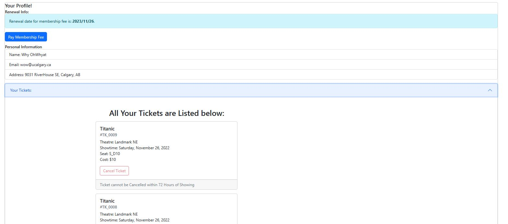
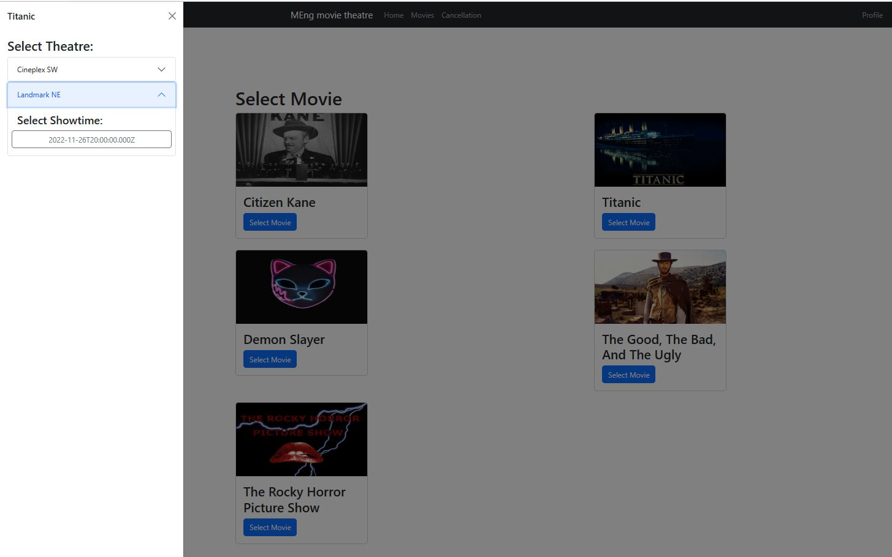
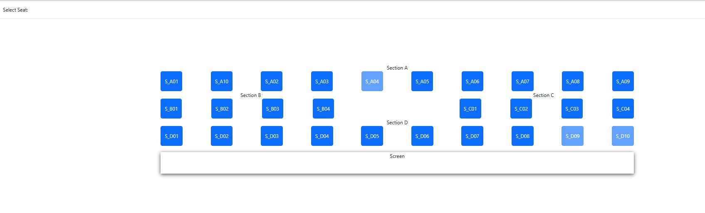
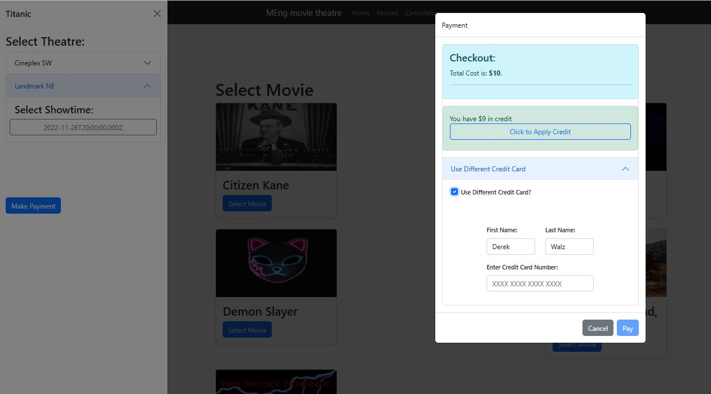
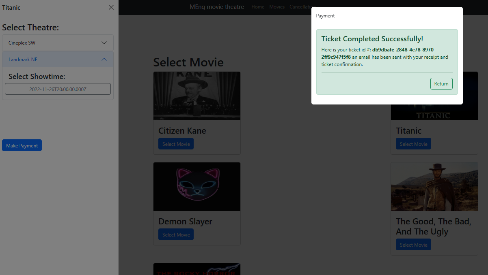

# Movie Ticket Reservation App

This is a full stack web app for a movie theatre ticket booking system. The project began as a MENG course project but I have updated the app with further functionality for gnraphical movie and seat selection. 

The application follows client-server design with communication using REST apis. The backend is built with Express on Node.js, front end is built with React, and the database is using MySQL. 

Specifically I completed all payment funcitonality (frontend, backend, relational database), as well as back end ticket functionality and front end profile page. 
I have also refactored the front end to improve the movie selection process including adding graphical displays and selections for movie, showtime, and seat selection.  

Original Authors: 
- Derek Walz 
- Graeme Folk
- Alexander Kruger
- Hanzhe Wei

## Instructions for building and running locally:

A sample .env file with environment variables necessary for running the server has been placed in the /server folder. The DB_USER and DB_Pass fields in particular need to be provided to match a user's specific individual MySQL settings, or else the app will not be able to communicate with the data store.

### Backend:
1. Go to the server directory (cd server)
2. Run the server (node server.js)

The server will run on http://localhost:5000. 

### Database:
1. Load your MySQL server as per your individual machine settings
2. Run the 'MovieTheatre_DB.sql' script with your preferred method to construct the database schema and load sample data

### Frontend:
1. Go to client directory (cd client)
2. npm run build
3. npm install -g serve
4. serve -s build

The client will now be running on http://localhost:3000. Visit the address in a web browser to navigate and use the app.

## Example Functionality
### Registered or Unregistered User

The web app is designed to be used by either a registered user or a guest. Both options provide the same functionality for reserving a ticket. Registered users are able to see special movie offers and apply credit when purchasing a ticket. The registered user also has a profile page providing a list of tickets, cancellation functionality, and registration fee payment. Guest are able to register at any time and their credentials will be stored to the database. 

### Movie Selection Process

The web app allows users to choose any of the listed movies, which prompts an overlay for choice of theatre and showtime. 

Once a showtime is chosen the seat layout is shown graphically and an available seat can be clicked. 

At this point payment is required. The registered user can pay with available credit, their card on file, or by other means.

If payment is successful the ticket id is presented in the ticket success banner and an email is sent to the user. 

